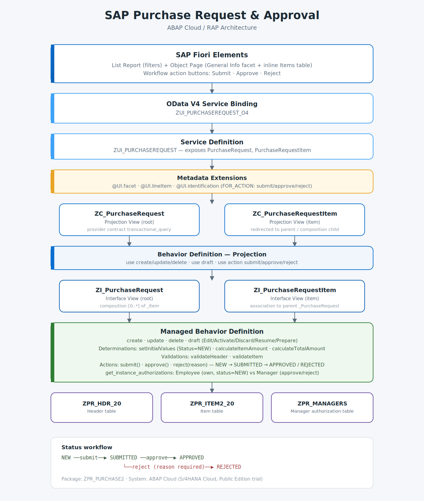
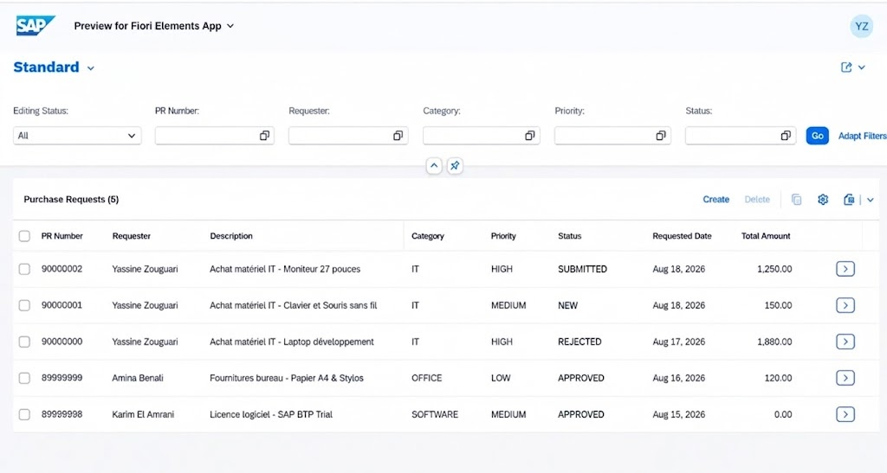
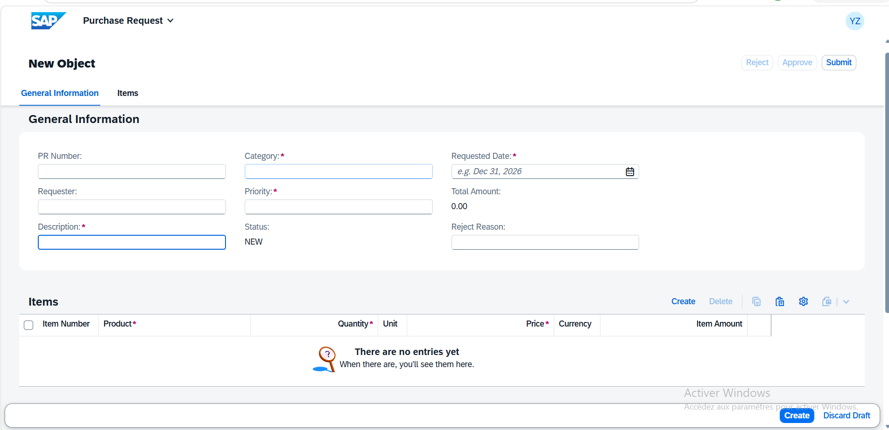
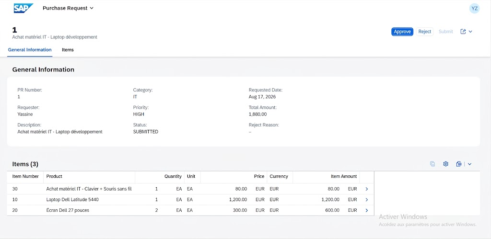
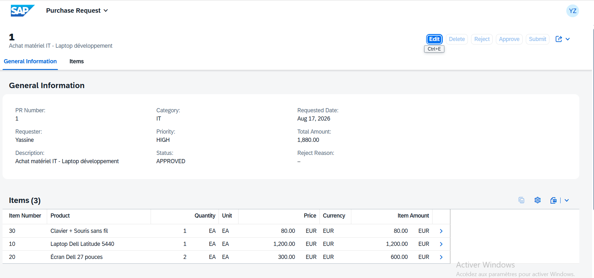

# SAP Purchase Request & Approval

**An end-to-end SAP RAP (RESTful ABAP Programming Model) application built on ABAP Cloud**, covering data modeling, transactional behavior, a multi-step approval workflow, role-based authorization, and a SAP Fiori Elements UI consumed via OData V4.

Built as a hands-on complement to the **SAP Backend Developer – ABAP Cloud** certification, to demonstrate a complete, realistic application rather than isolated exercises.

`ABAP Cloud` · `RAP` · `CDS View Entities` · `Behavior Definitions` · `Draft Handling` · `OData V4` · `SAP Fiori Elements`

---

## Business Scenario

An employee creates a purchase request with one or more line items. The system automatically computes line and total amounts. The employee submits the request; a manager then approves or rejects it — with a mandatory reason on rejection.

```
NEW ──submit──► SUBMITTED ──approve──► APPROVED
                    │
                    └──reject (reason required)──► REJECTED
```

Every transition is enforced server-side: an action is rejected with a business error message if the current status doesn't allow it (e.g. approving a request that hasn't been submitted).

---

## Architecture



Seven layers, top to bottom: **Fiori Elements → OData V4 Service Binding → Service Definition → Metadata Extensions → Projection Views → Projection Behavior → Interface Views → Managed Behavior Definition → Database Tables.**

The **Managed Behavior Definition** is where the actual business logic lives: draft handling, automatic calculations (determinations), business rules (validations), the approval workflow (custom actions), and instance-level authorization.

---

## Features

**Transactional core**
- Full CRUD on header and items with standard SAP **draft handling** (Edit / Activate / Discard / Resume / Prepare)
- Root–child data model via **composition** (Purchase Request → Items)

**Automatic calculations** (RAP determinations)
- `ItemAmount = Quantity × Price` per line item
- `TotalAmount = Σ ItemAmount`, recalculated on every item create / update / delete

**Business validations**
- Quantity must be greater than 0
- Product and Description are mandatory

**Approval workflow** (custom RAP actions)
- `submit()` — NEW → SUBMITTED
- `approve()` — SUBMITTED → APPROVED
- `reject()` — SUBMITTED → REJECTED, with a mandatory reject-reason parameter
- Invalid transitions raise explicit business error messages

**Instance-based authorization** (`get_instance_authorizations`)
- Employees can update or delete only their own requests, and only while status = NEW
- Only users listed in `ZPR_MANAGERS` can execute `approve` / `reject`
- Fiori Elements automatically disables buttons the current user isn't authorized to trigger — no manual UI logic required

**Fiori Elements UI**
- List Report with filters (PR Number, Requester, Category, Priority, Status)
- Object Page with a General Information facet and an inline Items table
- Workflow buttons (Submit / Approve / Reject) driven entirely by backend authorization state

---

## Screenshots

**List Report — requests across every status**


**Creating a new request — draft mode, header + items**


**Manager view — request SUBMITTED, Approve/Reject enabled**


**Request APPROVED — items and computed total**


---

## Source Code

```
src/
├── 01-database-tables/          Persistent tables (header, item, managers)
├── 02-cds-interface-views/      Interface views — composition / association
├── 03-cds-access-controls/      DCLS authorization roles
├── 04-cds-projection-views/     Projection views — redirected associations
├── 05-behavior-definitions/     Managed + Projection behavior definitions
├── 06-metadata-extensions/      Fiori UI annotations (@UI.facet, @UI.lineItem...)
├── 07-service-definitions/      OData service exposure
├── 08-abap-classes/             Behavior implementation: determinations,
│                                 validations, actions, authorizations
└── 09-structures/                Action parameter structure (reject reason)

diagrams/
└── architecture.svg / .png      Architecture diagram

screenshots/                     App screenshots referenced above
```

> These are DDL / DCLS / CLAS source extracts exported from ADT (Eclipse), meant to be copied into the matching repository object type in a live ABAP Cloud system (Data Definition, Access Control, Behavior Definition, Metadata Extension, Class...). ABAP Cloud development happens against a live system via ADT, so this isn't a clonable/runnable repo — it's a source reference for the implementation.

---

## Also Implemented

- **ABAP Unit tests** for the behavior implementation (determinations, validations, actions)
- **Requester auto-populated** from `sy-uname` on creation, instead of manual entry
- UI polish: removed duplicate Unit/Currency text columns, default sort by Item Number

---

## Technologies

`ABAP Cloud` · `RAP (RESTful ABAP Programming Model)` · `CDS View Entities` · `Behavior Definitions (Managed & Projection)` · `Draft Handling` · `Determinations & Validations` · `Instance Authorization` · `OData V4` · `SAP Fiori Elements` · `Metadata Extensions` · `ABAP Unit`

---

## What This Project Demonstrates

Rather than a simple CRUD exercise, this covers a realistic ERP need end to end:

- Data modeling with a root/child hierarchy (composition)
- Full transactional behavior with draft
- Computed fields via determinations
- Business rule enforcement via validations
- A genuine multi-step business workflow via custom actions
- Role-based instance authorization
- A consumable Fiori Elements UI on top of OData V4
- Automated tests via ABAP Unit

---

**Yassine Zouguari**
[LinkedIn](https://linkedin.com/in/yassine-zouguari-b3319a2b2) · [GitHub](https://github.com/Zouguari)
